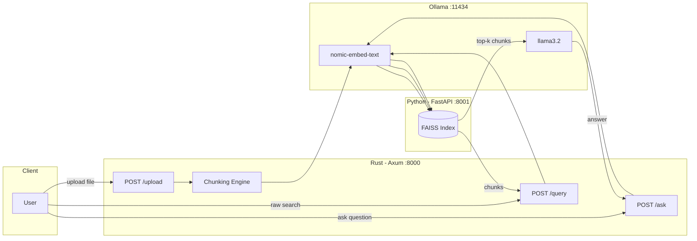
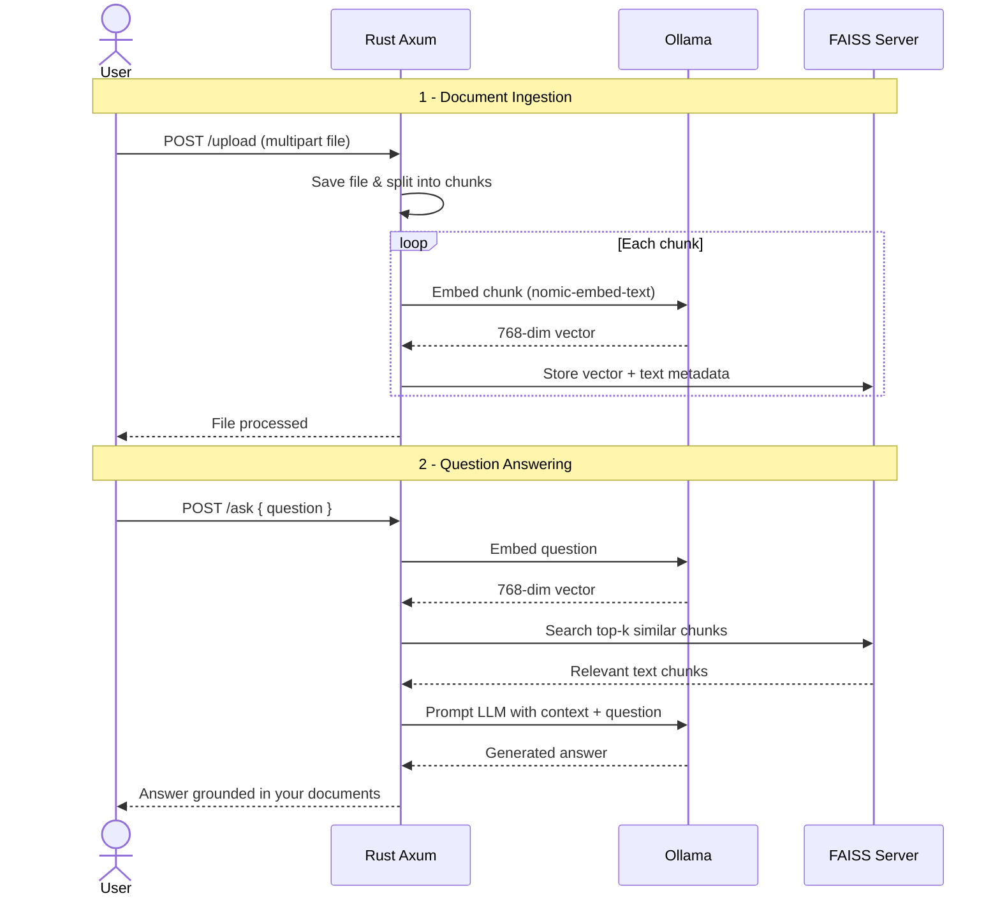
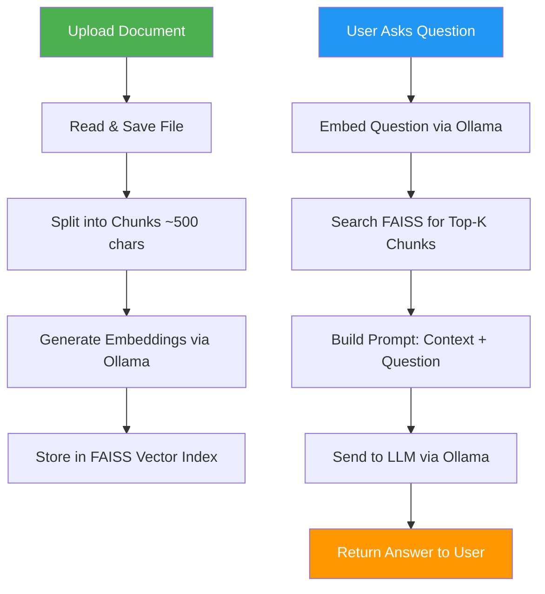

# DocuQuery

> A lightweight, private RAG system built for edge applications.

Upload your documents. Ask questions in natural language. Get answers grounded in your own data — **entirely offline, no cloud required**.

Built with **Rust** for performance and **Python** for vector search, DocuQuery is designed to run on laptops, desktops, or even a Raspberry Pi.

---

## Architecture



---

## RAG Pipeline



---

## Features

- **Upload documents** — `.txt` and `.md` files, automatically chunked and embedded
- **Semantic search** — find relevant passages using vector similarity (FAISS)
- **RAG answers** — LLM generates answers citing your own documents
- **Fully local** — no data leaves your machine; works offline
- **Lightweight** — runs on consumer hardware, no GPU required

---

## Tech Stack

| Layer | Technology | Role |
|-------|-----------|------|
| **API Server** | Rust + Axum | HTTP API, file processing, orchestration |
| **Embeddings** | Ollama + `nomic-embed-text` | Convert text to 768-dim vectors |
| **LLM** | Ollama + `llama3.2` | Generate answers from context |
| **Vector Store** | Python + FastAPI + FAISS | Similarity search over embeddings |

---

## Project Structure

```
DocuQuery/
├── src/                        # Rust backend
│   ├── main.rs                 # Axum server & route setup
│   ├── routes/
│   │   ├── upload.rs           # File upload, chunk, embed, store
│   │   ├── query.rs            # Semantic search (returns raw chunks)
│   │   └── ask.rs              # Full RAG pipeline (search + LLM)
│   ├── services/
│   │   ├── embeddings.rs       # Ollama embedding client
│   │   ├── semantics.rs        # FAISS HTTP client (add/search)
│   │   └── llm.rs              # Ollama LLM client (streaming)
│   └── utils/
│       ├── file.rs             # File save & read helpers
│       └── chunk.rs            # Text chunking logic
├── faiss_server/               # Python FAISS microservice
│   ├── main.py                 # FastAPI app (add/search endpoints)
│   ├── requirements.txt
│   └── index_store/            # Persisted FAISS index + metadata
├── uploads/                    # Uploaded documents
├── diagrams/                   # Mermaid architecture diagrams
├── Cargo.toml
├── Dockerfile                  # Multi-stage Rust build
├── docker-compose.yml          # One-command full stack setup
├── .env                        # Configuration (not committed)
└── .gitignore
```

---

## Getting Started

### Prerequisites

- [Rust](https://rustup.rs/) (1.70+)
- [Python](https://python.org/) (3.10+)
- [Ollama](https://ollama.com/) installed and running

### 1. Pull the required models

```bash
ollama pull nomic-embed-text
ollama pull llama3.2
```

### 2. Set up the FAISS server

```bash
cd faiss_server
python -m venv venv

# Linux/macOS
source venv/bin/activate

# Windows
.\venv\Scripts\Activate.ps1

pip install -r requirements.txt
uvicorn main:app --host 0.0.0.0 --port 8001
```

### 3. Configure environment

Create a `.env` file in the project root:

```env
OLLAMA_EMBEDDING_URL=http://localhost:11434/api/embeddings
OLLAMA_EMBEDDING_MODEL=nomic-embed-text
OLLAMA_LLM_URL=http://localhost:11434/api/generate
OLLAMA_LLM_MODEL=llama3.2
FAISS_ADD_URL=http://localhost:8001/add
FAISS_SEARCH_URL=http://localhost:8001/search
```

### 4. Run the Rust server

```bash
cargo run
```

The API will be available at `http://localhost:8000`.

---

### Quick Start with Docker Compose

Alternatively, run everything with a single command — no manual setup needed:

```bash
docker compose up --build
```

This starts all three services:

| Service | Container | Port |
|---------|-----------|------|
| Rust API | `docuquery-backend` | `:8000` |
| FAISS Server | `docuquery-faiss` | `:8001` |
| Ollama | `docuquery-ollama` | `:11434` |

Models (`nomic-embed-text` and `llama3.2`) are pulled automatically on first run.

To stop:

```bash
docker compose down
```

To stop and wipe all data (index, uploads, models):

```bash
docker compose down -v
```

---

## API Reference

### `GET /`

Health check.

```bash
curl http://localhost:8000/
# "Welcome to DocuQuery API"
```

### `POST /upload`

Upload a document (multipart form-data).

```bash
curl -X POST http://localhost:8000/upload \
  -F "file=@myfile.txt"
```

The file is saved, split into ~500-character chunks, each chunk is embedded via Ollama, and stored in FAISS.

### `POST /query`

Semantic search — returns the most relevant document chunks.

```bash
curl -X POST http://localhost:8000/query \
  -H "Content-Type: application/json" \
  -d '{"question": "What is Rust?"}'
```

**Response:** JSON array of matching text passages.

### `POST /ask`

Full RAG — retrieves relevant chunks, sends them as context to the LLM, and returns a natural language answer.

```bash
curl -X POST http://localhost:8000/ask \
  -H "Content-Type: application/json" \
  -d '{"question": "What programming languages does the author want to learn?"}'
```

**Response:** A generated answer grounded in the uploaded documents.

---

## How It Works



---

## Design Decisions

| Decision | Rationale |
|----------|-----------|
| **Rust for the API** | Memory-safe, fast, low resource usage — ideal for edge devices |
| **FAISS as a separate microservice** | Keeps Rust code simple; FAISS has mature Python bindings |
| **Ollama for embeddings + LLM** | Single tool for both tasks, runs locally, easy model switching |
| **Streaming LLM responses** | Server processes streamed tokens for lower memory footprint |
| **500-char chunks** | Balances granularity vs. context for embedding quality |

---

## Future Improvements

| Feature | Description |
|---------|-------------|
| PDF support | Parse and chunk PDF documents |
| Web UI | Frontend with Tauri or React |
| Streaming output | Stream LLM answers to the client in real-time |
| Chunk overlap | Sliding window chunking for better context preservation |
| Multi-file queries | Search across multiple uploaded documents |

---

## License

MIT